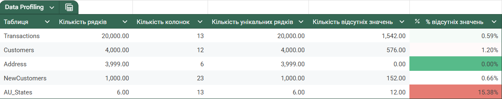
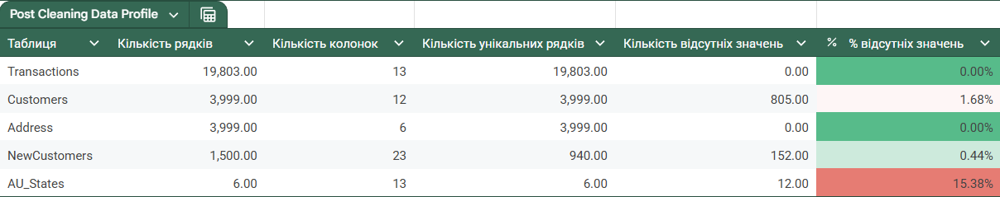
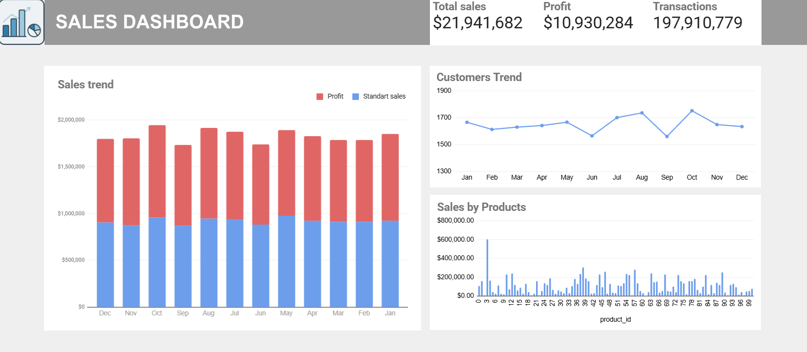

# DA_pet_project

## Мій пет-проєкт у сфері аналітики та роботі з даними

1. **Transactions:** Історія покупок.
2. **Customers:** Демографічні дані клієнтів.
3. **Address:** Адреси проживання.
4. **NewCustomers:** Список нових потенційних клієнтів.
5. **AU_States:** Довідкова таблиця штатів Австралії.

## Я провів 5 ключових етапів роботи з даними, а саме:

### 1. Problem definition
Встановлення проблеми - задача очистити дані, підготувати до аналізу, проаналізувати
### 2. Data collection
Завантаження ключових таблиць
### 3. Data Profiling
 Аналіз таблиць. Аркуш META Таблиця "Data Profiling". 
### 4. Data Transformation
 На цьому етапі було виправлено наступні неполадки:
   
*Таблиця Transactions*
     
- У колонках transaction_date, product_first_sold_date змінено формат на коректний - Date
- У колонці online_order пусті значення було позначено як UNKNOWN
- У колонці brand рядки з пустими значеннями було видалено, так як разом з цим пустували колонки з іншим описом продуктів та цінами.
- Додано колонку profits як резульат різниці list_price та standard_cost
- Було приєднано колонки "gender"	"past_3_years_bike_related_purchases"	"job title"	"industry"	"owns_car"	"age_clean" з таблиці Customers_clean використовуючи функцію VLOOKUP(), приклад: =VLOOKUP(C2,Customers_clean!$A$2:$M, 4, false), та колонку "region" з таблички Address_clean
- Було створено власну функцію з назвою =NBM_DAYS(), що рахує дні від transaction_date, та записано результати у нову колонку "nmb_days"

*Таблиця Customers*
    
- У колонці gender було виявлено не коректні записи статі - їх було урівняно до Male та Female. Всі записи U були переведені в більш зрозумілу форму Unspecified.
- Коректний формат дати у колонці "DOB". Також було виявлено значення 12/21/1843, що було замінено на середній вік замовника, щоб дані не спотворювались при аналізі.
- Колонки job title and industry було розбито на дві "job title" та "industry" для гнучкості у роботі.
 - Колонка default була видалена, через не придатні дані для роботи.
- Була створена колонка "age", для обчислення віку від народження до TODAY(). Де було виявлено  пусті значення, вони були замінені на вік по медіані шляхом функції =IF(F5="", 48, L5).
- Приєднана колонка region з таблиці Address_clean

*Таблиця Address*              
    
- Дані з колонки "state" було приведено до одного стилю написання штатів.
-------------------------------------------------------------------------
Дані після трансформації:

      
### 5. Data Analysis

На основі проробленої роботи було створено зведені таблиці та реалізована DashBoard

Загальний прибуток: $21,941,682
Чистий прибуток: $10,930,284

Аналітика по продуктах:
- продукт з id: 3 приніс найбільше прибутку $602,702
- також лідерами є id: 38 ($306k), id: 57 ($282k) та id: 46 ($261k).
- продукти id 0, 2, 61 приносять найменше прибутку.
 
Сезонність та динаміка продажів:
- Найбільші продажі помічені у жовтні, та серпні більше 1700 замовлень
- Жовтень став найприбутковішим місяцем $984,973 прибутку. За ним серпень, а далі березень.
